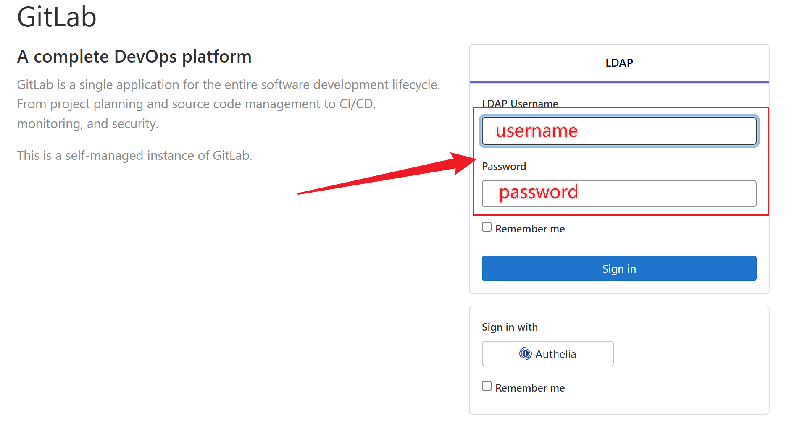
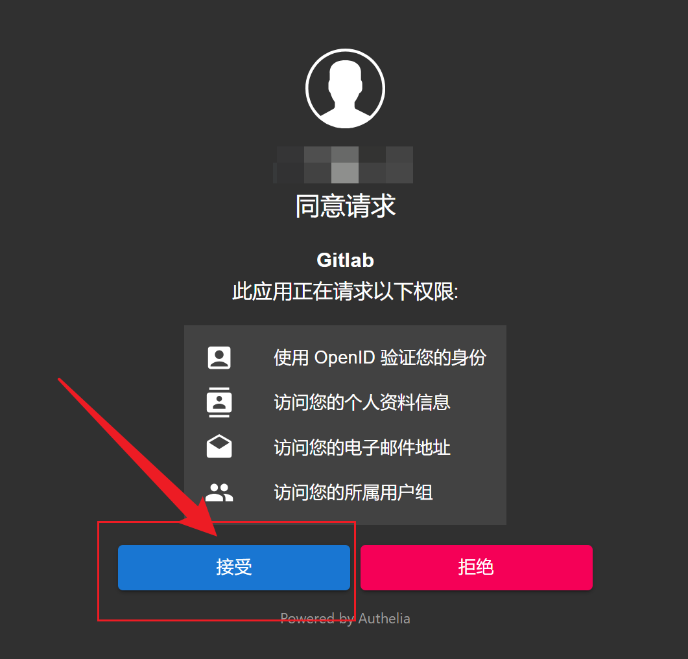
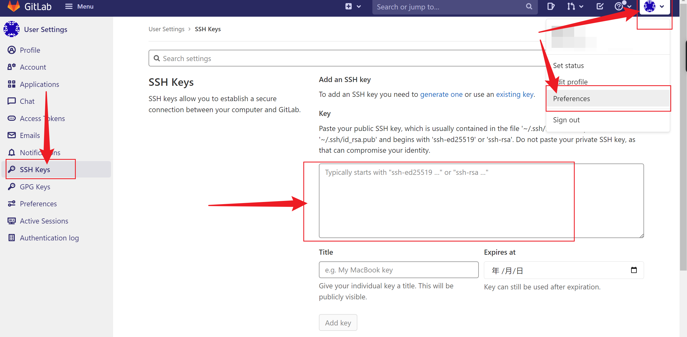

```note
There is a *self-hosted* **Gitlab** instance at **Gravity**
    ```http
    https://git.gravity.sjtu.edu.cn
    ```
```

## Login

[Open Gitlab on browser](https://git.gravity.sjtu.edu.cn/), there are **two ways** to login:

1. Your *Gravity* username and password
   
2. Use *Authelia* authorization at bottom of login page
   
   

## SSH Access

Like *Github*, you can use SSH to access *Gitlab*. But you need to add your SSH key to *Gitlab* first.

Generate SSH key:

```bash
ssh-keygen -t rsa -b 4096 -C "$NAME@Gravity-Gitlab" -f /home/$NAME/.ssh/id_rsa_gitlab -q -N ""
```

You will generate two files: `~/.ssh/id_rsa_gitlab, ~/.ssh/id_rsa_gitlab.pub`. Copy your *public key* content to *Gitlab*:

```bash
~>  cat ~/.ssh/id_rsa_gitlab.pub

# Output 👇
ssh-rsa AAAAB3NzaC1yc2EAAAADAQABAAACAQCcjFKepF608tQHKbrBJWSrUapb/cqFqJUNbCpqQT5UTzCY2j5CjlpNdxxxxxxxxxxxxxxxxxxxxxxxxxxxxxxxxxxxxxxxxxxxxxxxxxxxxxxxxxxxxxxxxxxxxxxxxxxxxxxxxxxxxxxxxxxxxxxxxxxxxxxxxxxxxxxxxxxxxxxxxxxxxxxxxxxxxxg3eHlDAVaM5nlP2Rk+z+7CG0lzcpH7BERKIQ== lalala@Gravity-Gitlab
```

Click account preferences on top right corner, then click **SSH Keys** on left sidebar, paste your public key to **Key** field, and click **Add key** button:


Last step, we need to configure SSH to use this key. Add following content to `~/.ssh/config`:

```bash
Host git.gravity.sjtu.edu.cn
    HostName git.gravity.sjtu.edu.cn
    Port 33
    IdentityFile ~/.ssh/id_rsa_gitlab
```

Let us try to access *Gitlab* now:

```bash
~> ssh -T git@git.gravity.sjtu.edu.cn

# Output 👇
Welcome to GitLab, @lalala!
```