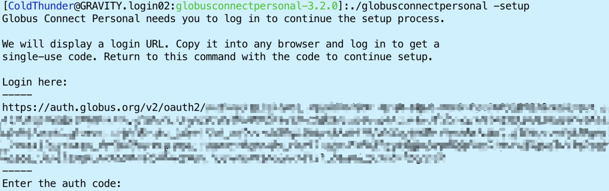
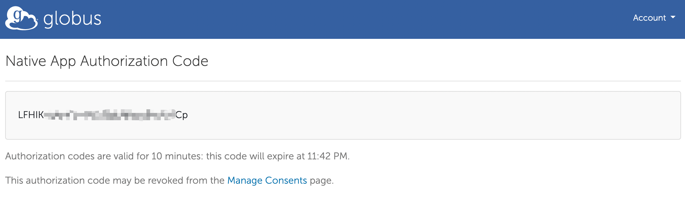
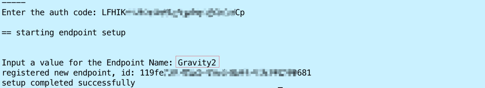
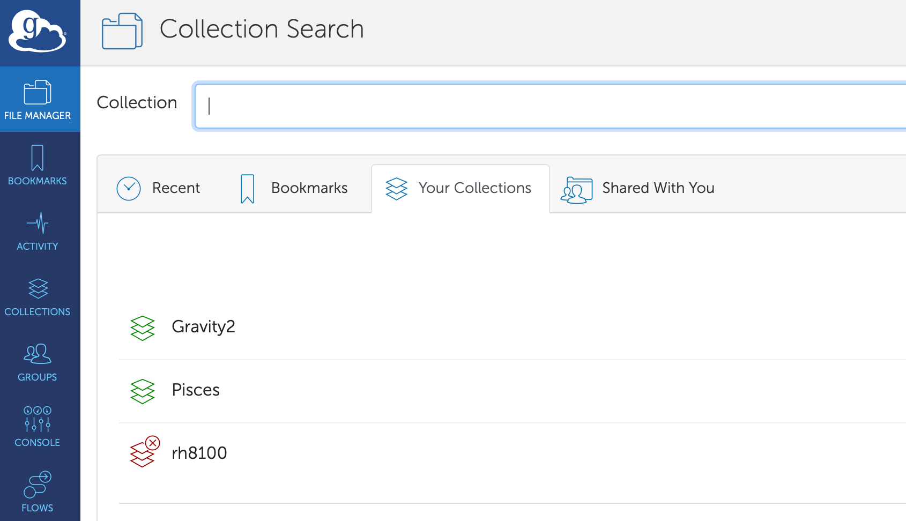

# Globus
[Globus](https://www.globus.org) is quite popular to transfer large scientific data.
Here we provide the routine to install Globus personal version.  You can also check the [globus documentation](https://docs.globus.org/how-to/globus-connect-personal-linux/).

1. Create your Globus account.
  You can use Google Account/ORCID/Globus ID, to sign in.

2. Download Globus Connect Personal
  ```bash
  wget https://downloads.globus.org/globus-connect-personal/linux/stable/globusconnectpersonal-latest.tgz
  ```

3. Extract the files from the downloaded tarball.
  ```bash
  $ tar xzf globusconnectpersonal-latest.tgz
  $ cd globusconnectpersonal-x.y.z
  ```
  (replace x.y.z with the version number)

4. Setup your personal profile
  ```bash
  ./globusconnectpersonal -setup
  ```

  

  A long link will be provided.  Copy and open the above link in your browser.  After sign in your globus account, an authorization code will be provided.

  

  Input this code in your terminal, type the name for this Endpoint (Gravity2 in the above case) and finish the setup.

  

5. Run Globus personal without GUI.
  ```bash
  ./globusconnectpersonal -start &
  ```

  Check whether the Endpoint is correctly appeared in your Globus Endpoint Collections.

  

6. Stop Globus personal.
  Please close your Globus personal when your transfer task is end, for safety and resources saving reason.
  ```bash
  globusconnectpersonal -stop
  ```

### Notes
Gravity login nodes do not support graphic tools, thus the prerequists listed in the Globus documentation (Tcl/Tk installed) is not required.