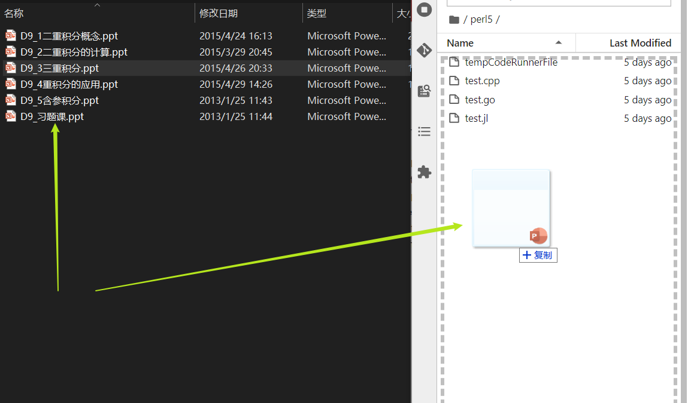

# Data Transfer

It is a common task to transfer files between different servers or your own desktop.
For transmission of large files, command lines like `scp` or `rsync` are usually recommended.
When one is making plots or editing codes, it might be more convenient to use 
techniques with graphical user interface support.

## FileServer
```note
You need to `copy`/`move` your files into `~/.fileServer` to use *FileServer*.   

If you need to **share massive data**, feel free to [contact admin🧙‍](https://gravity-doc.github.io/#contact)
```
### access
We have enabled a **File Server** on Gravity 🎉🎉🎉
You can access *fileserver* via:
- https://jupyter.gravity.sjtu.edu.cn/file/
- https://gravity.sjtu.edu.cn/file/

Cause we enable **2FA**, you need to install *Authenticator App* at the first time. See [more details here](https://gravity-doc.github.io/Basic/Login.html#web-login).

### properties
File Server supports:
- upload file
- download file (you can use download tools, such as **multi-thread** downloader)
- **share file** 🎉🎉🎉 (you can set **password/limiting time** of your sharing files)
- view file
- delete/create file

## Jupyter-lab/notebook
Because of the GUI of jupyter, you can easily transfer your data, as long as your data is not too large (eg. <10G)
> 1. login [JupyterHub](https://gravity.sjtu.edu.cn/)
> 2. start a server
> 3. **drag** your files (download or upload)



## Filezilla
[安装 Filezilla 软件](https://filezilla-project.org/)后，可以双击打开该软件，按照下图进行设置，完成后单击快速链接或者回车可以登录ftp 站点。
输入数据集群IP 用户名 密码和端口号，如下图所示：


## scp and rsync
Linux/Unix/Mac 用户可以使用命令行工具在集群和您自己的计算机之间传输数据。下列语句会将文件夹`data/`上传到主文件夹的`tmp/`。

```bash
$ scp -r data/ YOUR_USERNAME@TARGET_IP:tmp/
```

下列语句会将主文件夹的data.out下载到本地当前工作目录中。

```bash
$ scp YOUR_USERNAME@TARGET_IP:data.out ./
```

In a word 👇
```bash
# copy local file to Gravity
scp -i your_ssh_key ~/local_file username@gravity.sjtu.edu.cn:/home/username/remote_file
rsync -avP -e "ssh -i ~/.ssh/id_rsa_For_Gravity" local_file username@gravity.sjtu.edu.cn:remote_file
# copy Gravity file to local
scp -i your_ssh_key username@gravity.sjtu.edu.cn:remote_file local_file 
rsync -avP -e "ssh -i ~/.ssh/id_rsa_For_Gravity" username@gravity.sjtu.edu.cn:remote_file local_file
```

## SFTP

Gravity provides file access via SFTP.
One can use any file manager or FTP client that supports SFTP.

For example, one can open "dolphin" (file manager) on Linux and enter the following path in the location bar
```
sftp://username@gravity.sjtu.edu.cn/home/username
# replace `username` with your own user name
```
The system will mount it as a remote directory.
One can use this directory just as local directories.

If you are too lazy to enter password at every mounting, you can copy his SSH key to the server
```
ssh-copy-id username@gravity.sjtu.edu.cn
```


## SSHFS

Another popular way to mount a remote directory is to use SSHFS.
One can create a directory in his computer, e.g.,
```
mkdir ~/mnt/gravity
```
and mount the server as following,
```
sshfs username@gravity.sjtu.edu.cn/home/username ~/mnt/gravity -o auto_cache,reconnect,follow_symlinks -o Compression=no -o Ciphers=aes128-ctr
```
One may change these options for his own purpose.

It seems SFTP has better performance than SSHFS.
