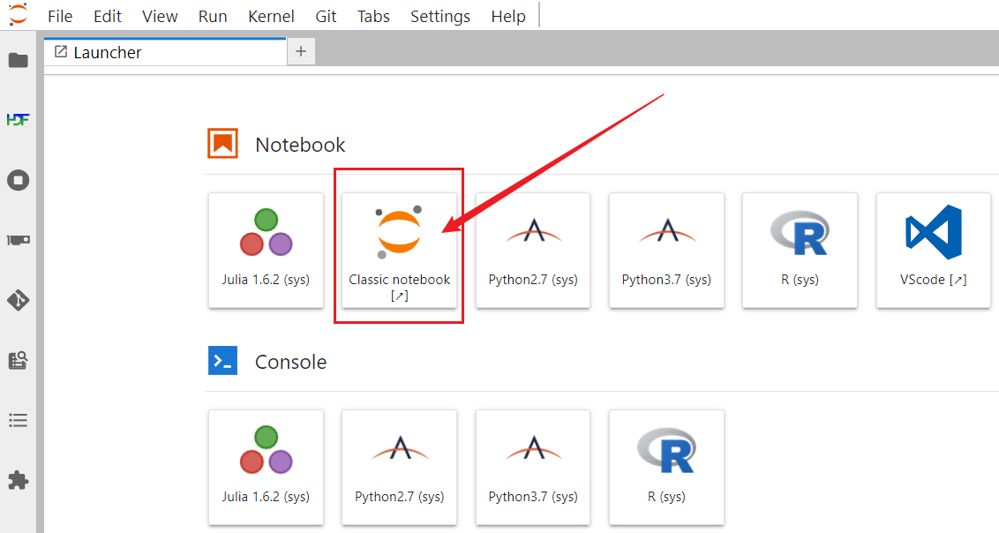
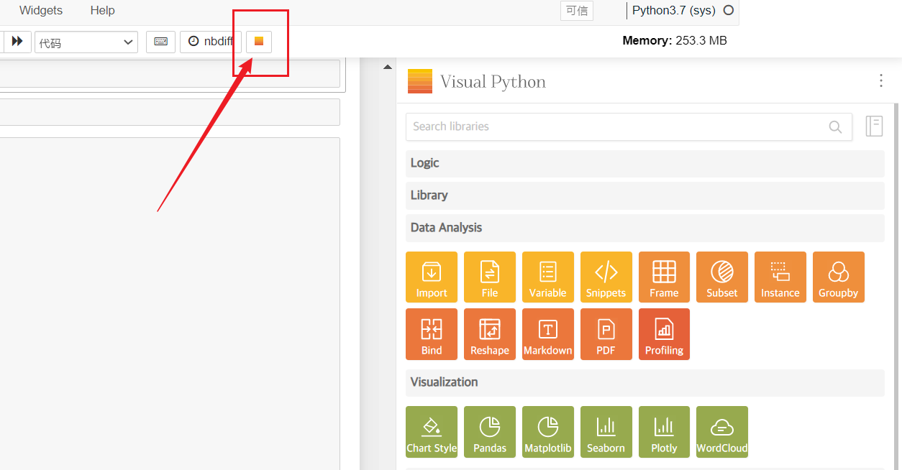
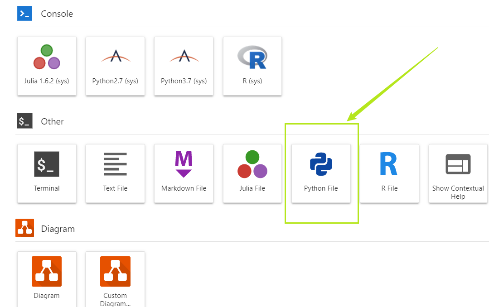
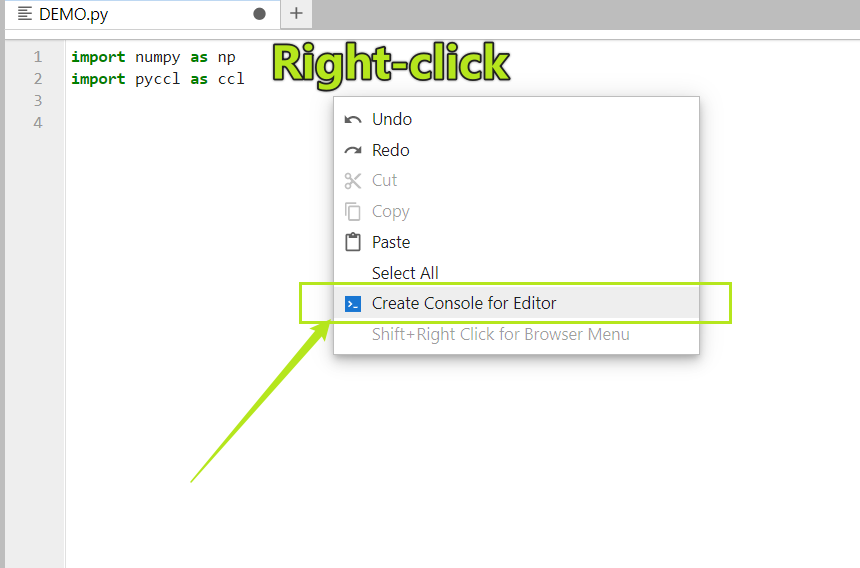
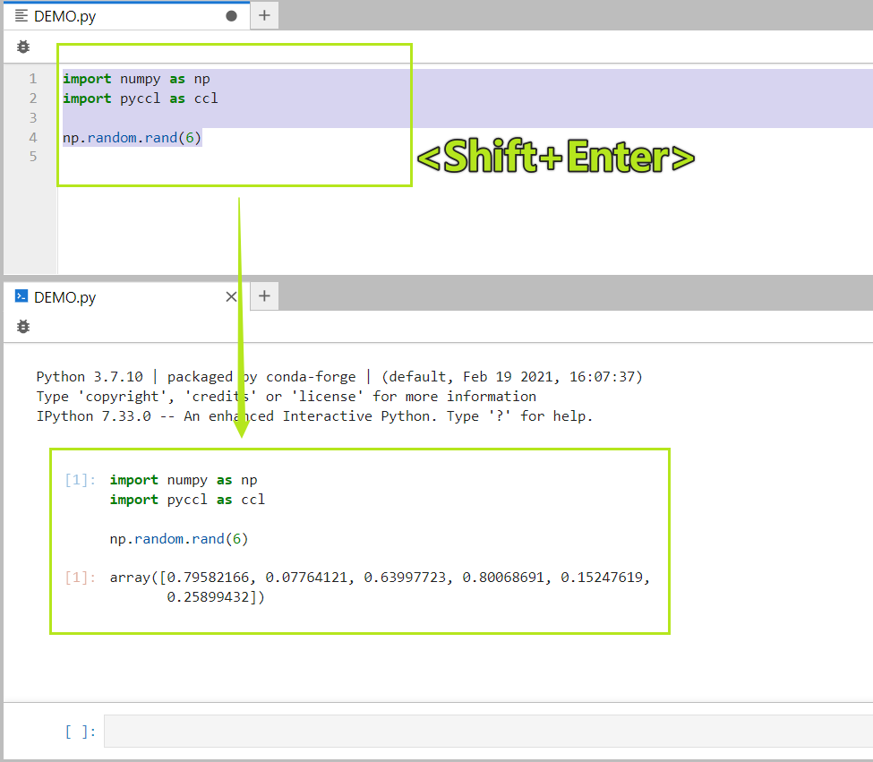
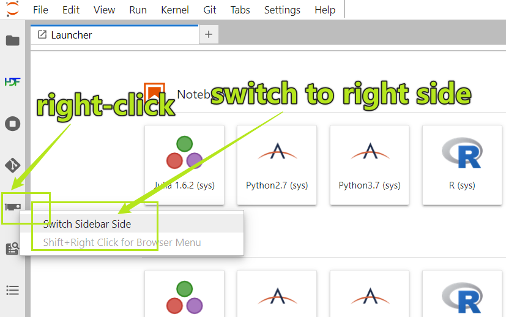
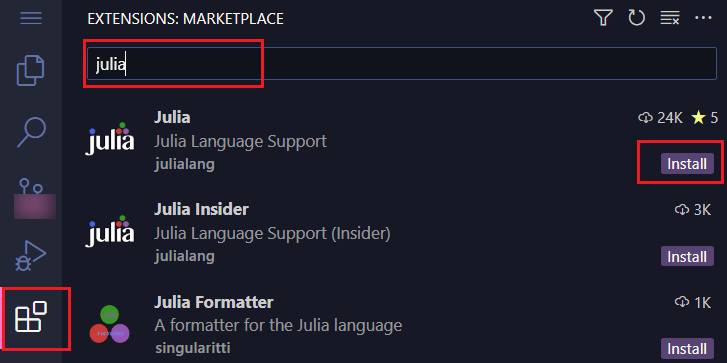
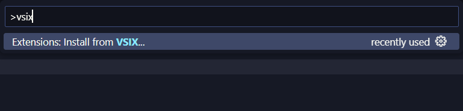
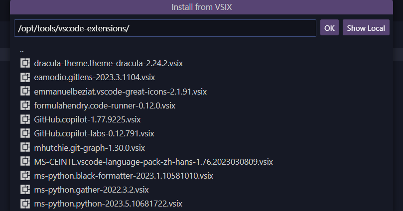

# Jupyter

```tip
[**JupyterHub**](https://jupyterhub.readthedocs.io/) is an entry to access jupyter-notebook/lab or other service ✨ 
- Jupyter-notebook/lab is the **easiest way** to coding 🥳
- VScode is the **best editor** in the Universe 💪
- You can use jupyter-notebook/lab or VScode on **both login and computing nodes** 😎     

You can access *Jupyter* on our website:   
- [Jupyter](https://jupyter.gravity.sjtu.edu.cn) (needs **2FA**)

- PS. We have enabled **Two-Factor Authentication (2FA)**🎉🎉🎉 More details are [Gravity Authentication](https://gravity-doc.github.io/Basic/Login.html#web-login)
```

```warning
**DO NOT** run heavy program on *login nodes* ❌🙅❌   

If you fail to log in, **DO NOT** try many times, your IP will **be banned** for a period of time 😭
```


## Login   
Visit website:
```http
https://jupyter.gravity.sjtu.edu.cn
```

click *Jupyter* button


input *username* + *password* + *TOTP*   
[more details about authentication](https://gravity-doc.github.io/Basic/Login.html#web-login)


## Usage
### start a server   
click *Start My Server* or *Named Servers* 

```warning
If you use *Named Servers*, its name **CAN NOT** contain any space😢!
```

choose one *Job queue*
> - [LOGIN] 👉 *login nodes* (forever)
> - [SMALL], [FAT], [GPU] 👉 *computing nodes* (time limited)


configure resource you want


### Start kernel
we provide some kernels, installed many useful packages 🎉
- *Python2.7 (sys)* (`/opt/conda/conda-4.12.0/envs/python2`)
- *Python3.7 (sys)* (`/opt/conda/conda-4.12.0/envs/python3`)
- *Julia (sys)*
- *R (sys)*


You have no permission to install new package in system kernels.
So, if there is **no package** you want or you want to **create your own kernel**, do as following:

### Create new environment/kernel
load anaconda

```bash
module load anaconda/conda-4.12.0 && source activate
```

create a new environment

```bash
conda create -n myenv  
# or use mamba, it's much faster ⚡⚡⚡
mamba create -n myenv
```

activate your own environment, here named `myenv`

```bash
conda activate myenv
```

install packages you want, here we install `camb` and `ipykernel`

```bash
conda install -c conda-forge camb ipykernel
# or use mamba, it's much faster ⚡⚡⚡ 
mamba install -c conda-forge camb ipykernel
```

install ipykernel (so that we can use this environment/kernel in *Jupyter*)

```bash
python -m ipykernel install --user --name myenv 
```

Now, refresh your *Jupyter*, and you can see your newly configured kernel. Select it for your notebook. enjoy 🎉

```tip

  The kernel name is also displayed in the top right corner of your notebook. To see the exact path for this environment:

  `import sys`   
  
  `sys.executable`   

  This will show the path of the python executable for the current notebook.
```

### Clone environment/kernel
If you wanna clone an existing environment, you can do as following:   
For example, we wanna clone *Python3.7 (sys)* (`/opt/conda/conda-4.12.0/envs/python3`) to `myenv`   

```bash
# load anaconda
module load anaconda/conda-4.12.0 && source activate

# clone environment
conda create -n myenv --clone /opt/conda/conda-4.12.0/envs/python3
# or use mamba, it's much faster ⚡⚡⚡
mamba create -n myenv --clone /opt/conda/conda-4.12.0/envs/python3

# activate environment
conda activate myenv

# install ipykernel
python -m ipykernel install --user --name myenv 
```

Now, refresh your *Jupyter*, and you can see your newly configured kernel. Select it for your notebook. enjoy 🎉

### Set environment variables
If your package needs some environment variables, like `LD_LIBRARY_PATH`, you need to edit the `kernel.json` file.   
For example🌰, we wanna set `LD_LIBRARY_PATH=/home/lalala/mylib:/home/.local/fftw/lib` and `module load gsl/2.5` for `myenv` environment/kernel   

First, we need to create a `helper_myenv.sh` script, which will be called by `kernel.json`.

```bash
# create a script and give it execution permission
touch ~/.local/helper_myenv.sh && chmod +x ~/.local/helper_myenv.sh
# edit it with vim
vim ~/.local/helper_myenv.sh
```

copy the following code to `helper_myenv.sh`, and save it

```bash
#!/bin/bash

# activate module command
source /etc/profile.d/modules.sh

# load what you need or change environment variable
module load gsl/2.5

# set environment variable
export LD_LIBRARY_PATH=/home/lalala/mylib:/home/.local/fftw/lib:$LD_LIBRARY_PATH

# go on ... (start ipython) DO NOT delete the last line!!!
exec "$@"
```

Next, we need to call this script in `~/.local/share/jupyter/kernels/myenv/kernel.json`, we **only need** to add one line below `"argv": [`.  Remember to use **absolute path** of `helper_myenv.sh`!


This is the original `kernel.json` file👇

```json
{
 "display_name": "myenv", 
 "language": "python", 
 "argv": [
  "/home/lalala/.conda/envs/myenv/bin/python",
  "-m", 
  "ipykernel_launcher", 
  "-f", 
  "{connection_file}"
 ]
}
```

This is the modified `kernel.json` file👇

```json
{
 "display_name": "myenv", 
 "language": "python", 
 "argv": [
  "/home/lalala/.local/helper_myenv.sh",
  "/home/lalala/.conda/envs/myenv/bin/python",
  "-m", 
  "ipykernel_launcher", 
  "-f", 
  "{connection_file}"
 ]
}
```

Now, refresh your *Jupyter*, and your `myenv` kernel will have the environment variables you set. enjoy 🎉
### Shutdown Jupyter

- If you want to close it **temporarily**, hoping it is still running background on *Gravity*, just **close your browser**.

- If you want to shutdown it **permanently**, click **File -> Hub Control Panel -> Stop My server**


## Tips

### Classic Notebook (old but fast)
If you prefer the **traditional jupyter-notebook**, it is faster than *JupyterLab*.


### Retrolab
*retrolab* is **Retro Style** of *JupyterLab*, it is faster than *Jupyterlab* 


It maintains most of properties of *Jupyterlab*. more like a modern *Jupyter-notebook*.


### Drag

You can drag the sub-window to reorganize your workspace like this


Even more, you can drag the unit block of the notebook to another notebook or a console.   

You can open python console combined with the notebook/text file (it's helpful when you wanna temporarily test or debug)   
> - In notebook, you can drag the unit block between notebook and console
> - In text file, you can use **Shift + Enter** to run the code in the console. Also , you can drag code from console.


### Data Transfer

If your need to download/upload files from/to *Gravity*, there is an easiest way that you just need to **drag** whatever you need into/out the Jupyterlab.

> PS. If your files are pretty large (eg. >10GB), you'd better use `scp, rsync` or other tools.

### Markdown

At *Launcher*, you can double click *Markdown file*, then right click to select **Show Markdown Preview** like this


### Python Documentation

If you are not familiar with some function or package, you can try to use **Show Contextual Help** in *Launcher*. You just need to click the function, and the **Help** (**documentation**) will display instantly!


### Diagram

You can click the **Diagram** at *launcher* to draw a flowchart


There are many templates


### Visual Python
[*visualpython*](https://visualpython.ai/) is a **Python code generator**. You just need to click some buttons to generate codes you want, such as data visualization, machine learning etc. ([*GIF example*](https://gravity.sjtu.edu.cn/file/api/public/dl/bjEJwMgn/image_video/Visual_Python_2.2.8.gif?inline=true))   
Because it **only** supports **Classic notebook** for now, we need to open *Classic* in *Jupyterlab*   



Click the orange button at top



Enjoy coding 🥳

### Git

From the sidebar, you can find a [Git extension](https://github.com/jupyterlab/jupyterlab-git).

- You can use it clone, pull, push, etc.
- You can use *diff* in the notebook to check what changes you've made.
- You can use it on *Login nodes* and *Computing nodes*


For example🌰, I wanna clone the `pyccl` repo

```link
https://github.com/LSSTDESC/CCL
```

Click the *Git* button → *Clone a Repository*


Input the link `https://github.com/LSSTDESC/CCL.git`


Success!!!


### Resource Monitor
From sidebar, you can find a **GPU dashboard** button


You can monitor the **real-time**  resource usage


### HDF5 Viewer
You can open and explore **HDF5 files** in JupyterLab.

Here is a `hdf5` file, you can click on it


Then you will see this panel, showing the data


You can explore the data, and even **filter** it!


### Variable Inspector
You can **right-click** your notebook, select `Open Variable Inspector`


It will open a sub-window showing current variables


### TAB Selection
when coding, you can use `<TAB>` to view the sub-function, and
- `<Shift>+<TAB>` upside
- `<TAB>` downside


### Text Coding
Open/create a text file `*.py`



Connect text file with a *kernel* (you can even connect a running *kernel*)
**`right click`** → **Create Console for Editor**



Now, this text file is more like a *notebook*.
Use **`<Shift+Enter>`** to run code selected



Use **`<TAB>`** to select *sub-function* etc.


### Adjust Sidebar
If you feel the sidebar has too many icons, **DO NOT worry**, let's change their place!
You can *right-click* the icon on the sidebar → *switch*, it will go to the right-side!



### Chinese
You can also change the language to Chinese(中文)


# VScode

As is well-known, *VScode* is the best editor for coding in the world 😜

> 1. 💪 thousands of extensions available
> 2. ⚡ much **faster** than Jupyter
> 3. 💯 support C/C++, Fortran, R, Go, Julia, Python etc.
> 4. 😎 install any extension you like, **customize** your own vscode!

```tip
1. **Only if** you stop the server from JupyterHub, can the VScode really stop.
2. It's better to use **Chrome** or **Edge** rather than ~~Firefox~~.
```

## Start
Start a *Jupyter Server*, click the *VScode* button


Coding, no matter you perfer C/C++ or Julia or other language, it's easy to use


Also, it **supports** *jupyter-notebook*


## Install Extensions
You can click *extension* button on the left, then **search** and **install** any *extension* you like! 😊



If you cannot find the extension you want, you can download the `vsix` file from [*marketplace*](https://marketplace.visualstudio.com/), then install it manually.

For example, we wanna install the *copilot* extension, use **`Ctrl+Shift+P`** to open the command panel, then type **`vsix`**, press `Enter`



We have downloaded some useful (I guess🥰) extensions at `/opt/tools/vscode-extensions`:
> - Black Formatter
> - Cmake Tools
> - Dracula Theme
> - Gather
> - Python
> - Pylance
> - Jupyter
> - Jupyter Powertoys
> - GitLens
> - Git Graph
> - VScode Great Icons
> - Code Runner
> - chatGPT中文版
> - Github Copilot
> - Github Copilot Labs
> - Markdown All in One
> - YAML
> - VScode 中文语言包

so we just enter this path: `/opt/tools/vscode-extensions`, select *copilot* or anything you like.



Now, enjoy your coding 🥳

