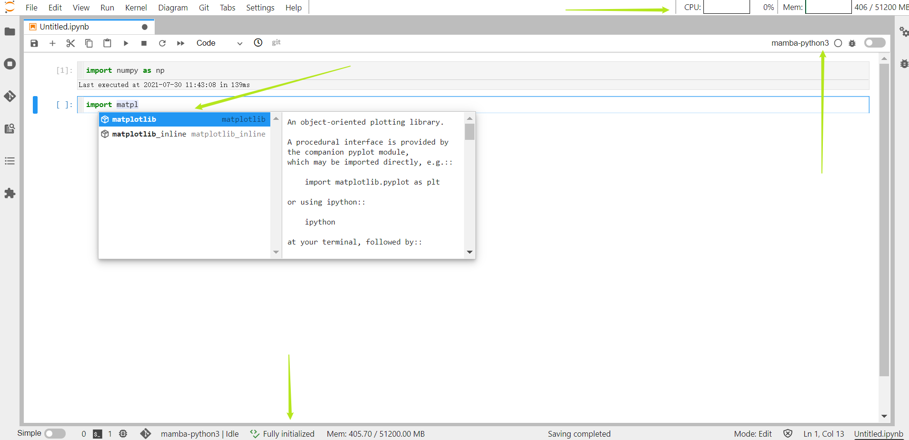

```tip
[**JupyterHub**](https://jupyterhub.readthedocs.io/) is an entry to access jupyter-notebook/lab or other service ✨ 
- Jupyter-notebook/lab is the **easiest way** to coding 🥳
- VScode is the **best editor** in the Universe 💪
- You can use jupyter-notebook/lab or VScode on **both login and computing nodes** 😎   

Please use your *username* and *password* of *Gravity* to log in.   

- [~~JupyterHub at login01~~ (*backup*)](https://gravity.sjtu.edu.cn/login01/)
- [JupyterHub at login02 (**main**)](https://gravity.sjtu.edu.cn/login02/)
- PS. In the **near future**, we will enable **Two-Factor Authentication (2FA)**🎉
```
```warning
**DO NOT** run heavy program on login nodes ❌🙅❌
```
```danger
When you fail to log in, **DO NOT** try many times, your IP will be **banned** 😭
```
1. login   
Visit [JupyterHub website](https://gravity.sjtu.edu.cn/), enter your *username* and *password* of **Gravity**.

2. start a server   
You can click the *Start My Server* button or use the *named* server below. You can create up to 3 named server and a default server.
```warning
If you use *named server*, its name **CAN NOT** contain any space!
```
3. choose configuration   
    You want to run your server on *login node* or *computing node*? Or, you wanna run it on *large node* or *small node*?

  > - [LOGIN] 👉 *login nodes* (running forever)
  > - [MINI], [SMALL], [FAT], [GPU] 👉 *computing nodes* (**use PBS job**, time limited)


```note
You need to wait for a while if you choose to start a server on **computing nodes**. If the resource is limited, it may fail.
```
# Jupyter-lab (notebook)
## Choose a kernel (environment)

Actually, a *kernel* represents a *virtual environment*, which means you can use all of the installed packages in this environment.

Also, we provide not only **python** kernel but other kernels like **C, C++, Fortran, Julia, R, Go, Rust**. We have already installed many useful packages in **mamba-python3, R, Julia**.    


There are **two** default `Python` kernels: *mamba-python2* and *mamba-python3*, which are `Python 2.7` and `Python 3.7` respectively. 

### create virtual environment

You have no right to install new package in `mamba-python2, mamba-python3`. Therefore, if you need to install your own packages, you can **create a new environment** by yourself. Open a terminal, then

```bash
module load anaconda/anaconda-mamba         # load anaconda
source activate                             # activate base environment
mamba create -n myenv                       #create a new clean (and empty) environment
# mamba create -n myenv python scipy          # alternatively, create a new environment, and populate it with python and scipy
# mamba create -n myenv --clone mamba-python3 # or clone an environment
conda activate myenv                        # activate your own environment
mamba install -c conda-forge camb           # install whatever you need | #conda install -c conda-forge camb #pip install hmf
```

### install ipykernel

After creating a new environment, you have to **install ipykernel** so that you can use it in *Jupyter-notebook/lab*

```bash
python -m ipykernel install --user --name myenv 
```

## Coding

You can use *notebook* or *text file* directly for coding. For example 🌰, double click a *notebook*, then you can see like this:



- In *notebook*, you can switch kernel at the top right.
- There is a little cute panel on the top right, displaying how much CPU and memory you are using. If your memory usage exceed the limit, your process will **be killed** **(login nodes)**
- The *auto-completion* will be activated when you open a *notebook*, which is at the bottom of your browser, you just need to press **\<TAB\>** button to use the **completion**. You need to **be patient** for the first time you open it 🤣

## Shutdown

- If you just wanna close it for now, hoping it is still running on *Gravity*, just **close your browser**.

- If you wanna close it permanently, click **File -> Hub Control Panel -> Stop My server**


## Tips

### Classic Notebook

If you prefer the **traditional** *jupyter-notebook*, you can easily switch to it.


### Drag

You can drag the sub-window to reorganize your workspace like this


Even more, you can drag the unit block of the notebook to another notebook or a console.   

You can open python console combined with the notebook/text file (it's helpful when you wanna temporarily test or debug)   
> - In notebook, you can drag the unit block between notebook and console
> - In text file, you can use **Shift + Enter** to run the code in the console. Also , you can drag code from console.


### Data Transfer

If your need to download/upload files from/to *Gravity*, there is an easiest way that you just need to **drag** whatever you need into/out the Jupyterlab.

> PS. If your files are pretty large (eg. >10GB), you'd better use `scp, rsync` or other tools.

### Markdown

At *Launcher*, you can double click *Markdown file*, then right click to select **Show Markdown Preview** like this


### Python Documentation

If you are not familiar with some function or package, you can try to use **Show Contextual Help** in *Launcher*. You just need to click the function, and the **Help** (**documentation**) will display instantly!


### Flowchart

You can click the **Diagram** at *launcher* to draw a flowchart


### Git

From the sidebar, you can find a [git plugin](https://github.com/jupyterlab/jupyterlab-git).

> - You can use it clone, pull, push, etc.
> - You can use *diff* in the notebook to check what changes you've made.


# VScode

As is well-known, *VScode* is the best editor for coding in the world 😜

> 1. 💪 thousands of extensions available
> 2. ⚡ much **faster** than Jupyterlab
> 3. 💯 support C/C++, Fortran, R, Go, Julia, Python
> 4. 😎 choose "**VScode [my]**" to **customize** your own vscode!

Here, wo provide two options:

> - *VScode [sys]*: You cannot install any plugin on it, however, in my opinion, it is enough to use. We have already installed many plugins and configured it well!
>
> - *VScode [my]*: This is **totally clean**. You can install/uninstall any plugin or change any configuration in it!

```tip
1. **Only if** you stop the server from JupyterHub, can the VScode really stop.
2. It's better to use **Chrome** or **Edge** rather than ~~Firefox~~.
```
Start *VScode* from *Jupyterlab*, double click 


Coding, no matter you perfer C/C++ or Julia or other language, it's easy to use


Also, it support *jupyter-notebook*


