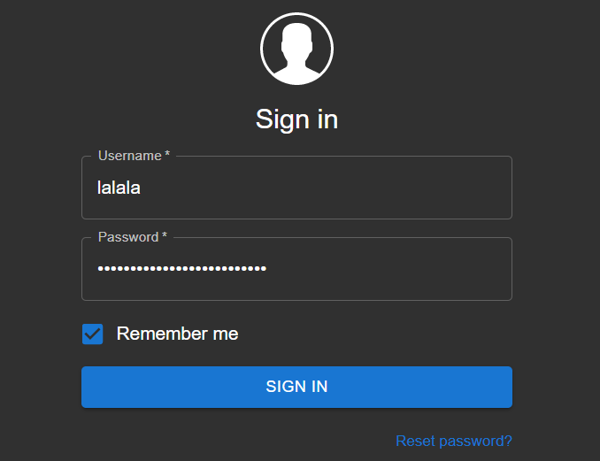
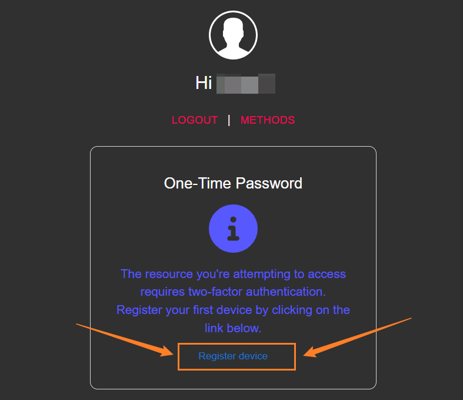
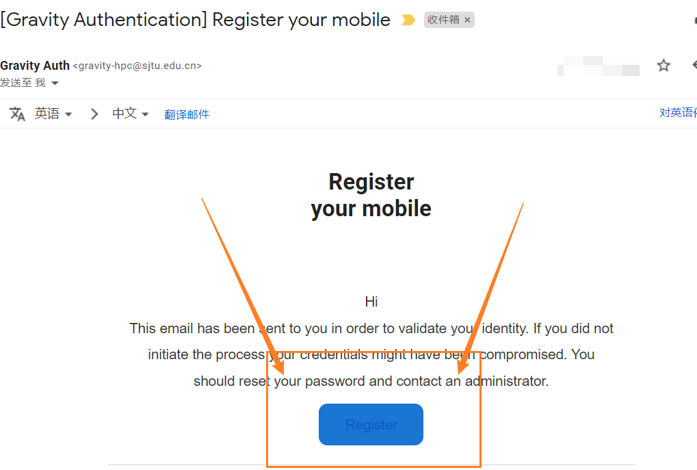
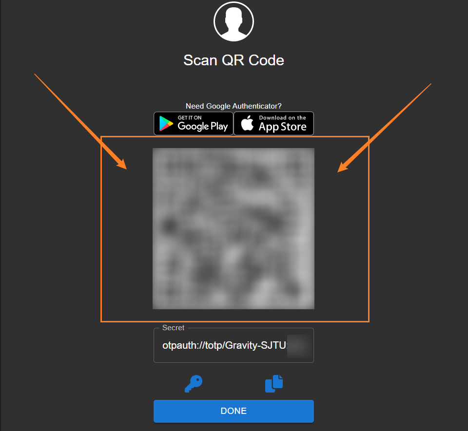
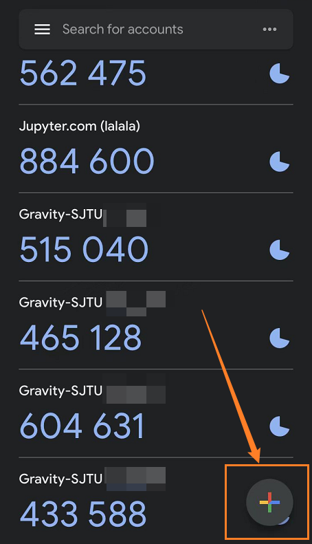
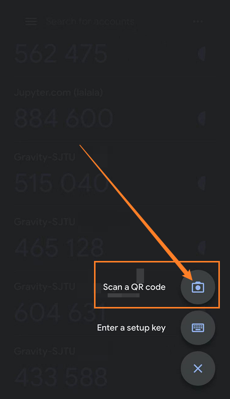
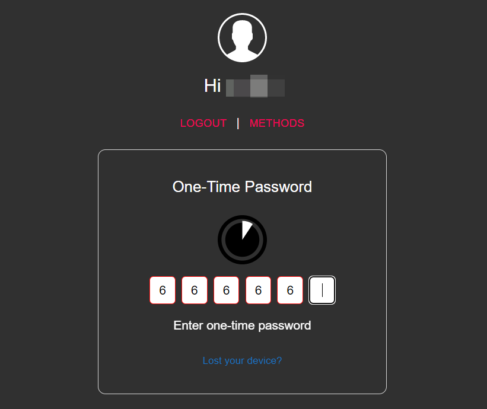

# Log in Gravity
```note
We have enabled **2FA** on website, you need to install an *Authenticator app* to log in website.    
Use `ssh` to log in only needs your **ssh privacy key**
```
```danger
If you fail to login, please do not try many times. Otherwise your IP will be **banned** for a period of time 😭
```

## SSH login
### 1. generate `ssh-key`

generate a [*ssh-key*](https://wiki.archlinux.org/title/SSH_keys_(%E7%AE%80%E4%BD%93%E4%B8%AD%E6%96%87)) pair   
open a terminal (Linux/Windows/Mac):
```bash
ssh-keygen
# Enter
# Enter
# Enter
```
It will generate two files:
- `id_rsa` (*private key*)
- `id_rsa.pub` (*public key*)

### 2. add `public key` to Gravity
You will be asked to provide your *public key* (`id_rsa.pub`) when registering. If everything is OK, skip this step.   
If you need to add `pub-key` manually:
- use *Jupyter's* *terminal* to add `id_rsa.pub` to `~/.ssh/authorized_keys`
- send the `pub-key` [via email📧 to us](https://gravity-doc.github.io/#contact), we will help you.

### 3. log in

Gravity has two login nodes: 
- *login01* [ **login01.gravity.sjtu.edu.cn** ] (backup)
- *login02* [ **gravity.sjtu.edu.cn** ] (main)

```bash
ssh -i <your_ssh_public_key> <username>@gravity.sjtu.edu.cn
# for example 🌰
ssh -i /home/lalala/.ssh/id_rsa_For_Gravity lalala@gravity.sjtu.edu.cn
```

```tip
You can set up your `~/.ssh/config` to **simplify** your command 😎   
```

Edit your `~/.ssh/config` like this:      

```
Host login01
    HostName login01.gravity.sjtu.edu.cn
    User lalala
    Port 22
    IdentityFile ~/.ssh/id_For_Gravity
Host login02
    HostName gravity.sjtu.edu.cn
    User lalala
    Port 22
    IdentityFile ~/.ssh/id_rsa_For_Gravity
```

Here we go 🥳      
```bash
ssh login01
ssh login02
```

If you do not like😒 the original terminal, here are some alternative softwares:
- *[MobaXTerm](https://mobaxterm.mobatek.net/download.html)* (Windows)
- *[Xshell](https://www.netsarang.com/en/xshell/)*  (Windows)
- *[Putty](https://www.ssh.com/ssh/putty/download)*  (Windows)
- *[Bitvise](https://www.bitvise.com/ssh-client-download)* (Windows)
- *[Termius](https://termius.com/)* (Mac/Linux/Windows/Android/iOS)
- *[FinalShell](https://www.hostbuf.com/t/988.html)* (Mac/Linux/Windows)
- *[iTerm](https://iterm2.com/)* (Mac)
   
## Web login
### 1. install Authenticator app
We enable **Two-factor authentication (2FA)** on Gravity website, so you need to install *Authenticator* on your phone/PC:

*Android* device
- [Duo Mobile](https://dl.duosecurity.com/DuoMobile-latest.apk) (can be accessed in China 🎉🎉)
- [Authy](https://authy.cn.uptodown.com/android) (can be accessed in China 🎉🎉)
- [LastPass Authenticator](https://lastpass-authenticator.cn.uptodown.com/android) (can be accessed in China 😆)
- [Google Authenticator](https://authenticator.cn.uptodown.com/android) (can be accessed in China 😆)
- [Microsoft Authenticator](https://azure-authenticator.cn.uptodown.com/android) (can be accessed in China 😆)
- [Google Authenticator](https://play.google.com/store/apps/details?id=com.google.android.apps.authenticator2) (official, but you need to access Google Play 🙄)
- [Microsoft Authenticator](https://www.microsoft.com/en-us/security/mobile-authenticator-app) (official, but you need to access Google Play 🙄)

*iOS* device
- [Google Authenticator](https://apps.apple.com/cn/app/google-authenticator/id388497605) (can be accessed in China 🎉🎉)
- [Microsoft Authenticator](https://apps.apple.com/cn/app/microsoft-authenticator/id983156458) (can be accessed in China 🎉🎉)
- [Twilio Authy](https://apps.apple.com/cn/app/twilio-authy/id494168017) (can be accessed in China 🎉🎉)
- [Duo Mobile](https://apps.apple.com/cn/app/duo-mobile/id422663827) (can be accessed in China 🎉🎉)

### 2. add Gravity 2FA
open [Gravity Authentication webpage](https://gravity.sjtu.edu.cn/auth/), input your *username* + *password*


click *Register device*


check your mailbox, click *Register button*


open your phone's authenticator app


click *add* button


*scan* QR code


input your *Time-based one-time password (TOTP)*, enjoy! 🎉🎉🎉


# 登陆 Gravity（中文版）
```note
我们已在网站上启用*2FA*认证，您需要安装2FA应用才能够在网页端登陆   
若您使用ssh方式登陆，则仅需ssh key
```
```danger
请勿多次失败登陆，您的IP将会被封禁一段时间 😭
```
## SSH登陆

### 1. 生成 ssh key 密钥对

生成 [ssh key](https://wiki.archlinux.org/title/SSH_keys_(%E7%AE%80%E4%BD%93%E4%B8%AD%E6%96%87)  
打开终端（Linux/Windows/Mac）：
```bash
ssh-keygen
# 回车
# 回车
# 回车
```
这将会生成两个文件：
- `id_rsa` (*私钥*)
- `id_rsa.pub` (*公钥*)

### 2. 将`公钥`添加至Gravity
在注册账号时，您已经提供了公钥，若一切正常，则忽略此步骤。

若您想要手动添加公钥：
- 使用*Jupyter*的终端，将公钥`id_rsa.pub`添加至`~/.ssh/authorized_keys`即可
- 将公钥`id_rsa.pub`通过[邮件发送](https://gravity-doc.github.io/#contact)给我们，我们将帮您添加。

### 3. 登陆
Gravity拥有两个登陆节点：
- 登陆节点一号 *login01* [ **`login01.gravity.sjtu.edu.cn`** ]（备用）
- 登陆节点二号 *login02* [ **`gravity.sjtu.edu.cn`** ]（主用）

```bash
ssh -i <你的私钥> <用户名>@gravity.sjtu.edu.cn
# 举个栗子 🌰
ssh -i /home/lalala/.ssh/id_rsa_For_Gravity lalala@gravity.sjtu.edu.cn
```
```tip
您可以设置 `~/.ssh/config` 来**简化**命令 😎   
```
像这样修改文件`~/.ssh/config`：
```
Host login01
    HostName login01.gravity.sjtu.edu.cn
    User lalala
    Port 22
    IdentityFile ~/.ssh/id_For_Gravity
Host login02
    HostName gravity.sjtu.edu.cn
    User lalala
    Port 22
    IdentityFile ~/.ssh/id_rsa_For_Gravity
```

搞定！ 🥳 
```bash
ssh login01
ssh login02
```

若您不喜欢😒原生的终端，这里有可选的软件：
- *[MobaXTerm](https://mobaxterm.mobatek.net/download.html)* (Windows)
- *[Xshell](https://www.netsarang.com/en/xshell/)*  (Windows)
- *[Putty](https://www.ssh.com/ssh/putty/download)*  (Windows)
- *[Bitvise](https://www.bitvise.com/ssh-client-download)* (Windows)
- *[Termius](https://termius.com/)* (Mac/Linux/Windows/Android/iOS)
- *[FinalShell](https://www.hostbuf.com/t/988.html)* (Mac/Linux/Windows)
- *[iTerm](https://iterm2.com/)* (Mac)


## Web登陆
### 1. 安装authenticator应用
我们在网站上启用了二次验证（2FA），因此您需要在电脑/手机上安装软件后才能登陆：

*Android* device
- [Duo Mobile](https://dl.duosecurity.com/DuoMobile-latest.apk) (中国正常访问 🎉🎉)
- [Authy](https://authy.cn.uptodown.com/android) (中国正常访问 🎉🎉)
- [LastPass Authenticator](https://lastpass-authenticator.cn.uptodown.com/android) (中国正常访问 😆)
- [Google Authenticator](https://authenticator.cn.uptodown.com/android) (中国正常访问 😆)
- [Microsoft Authenticator](https://azure-authenticator.cn.uptodown.com/android) (中国正常访问 😆)
- [Google Authenticator](https://play.google.com/store/apps/details?id=com.google.android.apps.authenticator2) (官方，但您需要访问 Google Play 🙄)
- [Microsoft Authenticator](https://www.microsoft.com/en-us/security/mobile-authenticator-app) (官方，但您需要访问 Google Play 🙄)

*iOS* device
- [Google Authenticator](https://apps.apple.com/cn/app/google-authenticator/id388497605) (中国正常访问 🎉🎉)
- [Microsoft Authenticator](https://apps.apple.com/cn/app/microsoft-authenticator/id983156458) (中国正常访问 🎉🎉)
- [Twilio Authy](https://apps.apple.com/cn/app/twilio-authy/id494168017) (c中国正常访问 🎉🎉)
- [Duo Mobile](https://apps.apple.com/cn/app/duo-mobile/id422663827) (中国正常访问 🎉🎉)

### 2. 添加Gravity的二次验证
打开 [Gravity认证页面](https://gravity.sjtu.edu.cn/auth/), 输入您的 *用户名* + *密码*


点击 *注册设备*


检查您的邮箱，点击 *注册* 按钮


打开您手机上的 authenticator 应用，准备扫描二维码


点击*加号*按钮


点击*扫描二维码*


输入您的 *二次验证码*, 开始征途吧！🎉🎉🎉
