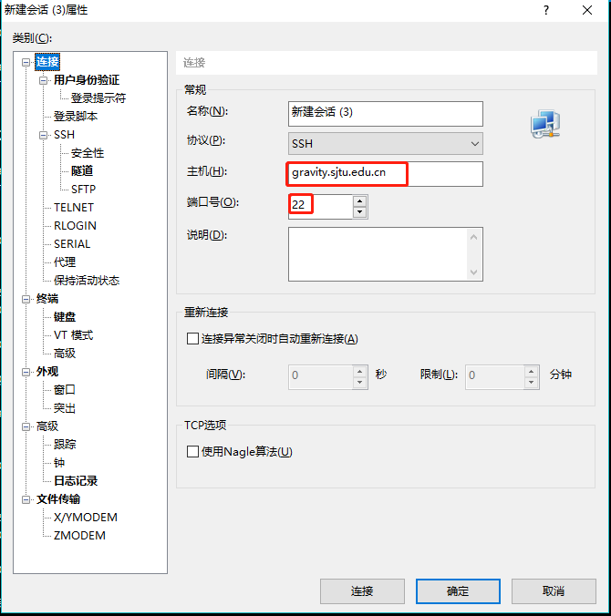
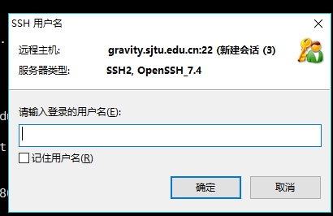
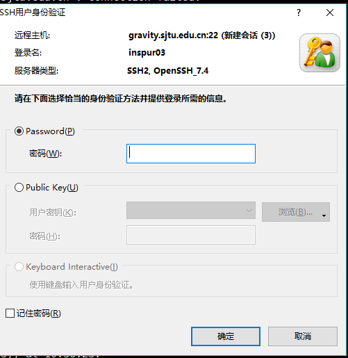

```danger
If you fail to login, please do not try many times. Otherwise your IP will be **banned** 😭
```

## Preparation

Out of security considerations, Gravity does **NOT** allow login with *password*. You have to generate a [**ssh-key**](https://wiki.archlinux.org/title/SSH_keys_(%E7%AE%80%E4%BD%93%E4%B8%AD%E6%96%87)) pair and add it to the server to login without a password. The key pair need to be generated and added once for each client computer.  

### generating a ssh-key pair
To generate a ssh-key pair, just open a terminal and run the following command (works on Linux/Windows/Mac):
```bash
ssh-keygen
# Enter
# Enter
# Enter
```
This will generate two files `id_rsa` (*private key*) + `id_rsa.pub` (*public key*) in your `~/.ssh` folder.

### adding ssh keys 
You will be asked to provide your public key (`id_rsa.pub`) when registering for an account. 

If for some reason you failed to provide the correct key, you can send us your public key file `id_rsa.pub` [via email](https://gravity-doc.github.io/#contact), and we will add the public key to your account. After the key is added, you can use your `id_rsa` (*private key*) to log in Gravity🥳. 

Alternatively, you can login to [jupyterhub](https://gravity-doc.github.io/Basic/JupyterHub.html), open a terminal, and add the content of your *public key* to `.ssh/authorized_keys` by yourself.

```warning
Please change your initial password immediately the first time you login, with the `yppasswd` command on login02.
```

## Log in

Gravity has two login nodes: login01 and login02. Use the domain name **gravity.sjtu.edu.cn** (login02) or **login01.gravity.sjtu.edu.cn** (login01) to log in.

```sh
ssh -i <your_ssh_key> <username>@gravity.sjtu.edu.cn
# for example 🌰
ssh -i /home/lalala/.ssh/id_rsa_For_Gravity lalala@gravity.sjtu.edu.cn
```

```tip
You can set up your `~/.ssh/config` to **simplify** your command 😎   
```

Edit your `~/.ssh/config` like this:      

```
Host login01
    HostName login01.gravity.sjtu.edu.cn
    User lalala
    Port 22
    IdentityFile ~/.ssh/id_For_Gravity
Host login02
    HostName gravity.sjtu.edu.cn
    User lalala
    Port 22
    IdentityFile ~/.ssh/id_rsa_For_Gravity
```
Here we go 🎉      
```sh
ssh login01
ssh login02
```

### Linux/Mac

On Linux/Mac, you can log in Gravity directly in the *shell*

> `ssh -i <your_ssh_key> <username>@gravity.sjtu.edu.cn`

### Windows

On Windows, you may need to install a ssh client first.    
- Windows 10 now comes with a default ssh client already installed. To use it, open windows `cmd` or powershell (type `cmd` or `powershell` in the windows search box next to the windows menu) and then you can use the ssh command.     
- If you prefer a **GUI client**, there are many available software such as the [Bitvise](https://www.bitvise.com/ssh-client-download) or [Putty](https://www.ssh.com/ssh/putty/download) or [Xshell](https://www.netsarang.com/en/xshell/).      
- We recommend  **[MobaXTerm](https://mobaxterm.mobatek.net/download.html)** (the best one I think😜)      


## 登陆集群

本文将向大家介绍如何通过 SSH 远程登录到 HPC 集群上。在阅读本文档之前，您需要具备 Linux/Unix、终端、MS-DOS、SSH 远程登录的相关知识，或者您可以阅读参考资料理解这些概念。

本文主要内容：

- 使用ssh登录集群的注意事项；
- 首次登录准备，如信息采集、客户端下载、ssh登录、ssh文件传输、无密码登录等；
- 故障排除和反馈。

按照文档的操作说明将有助于您完成工作，谢谢您的配合！

```note 
   * HPC账号仅限于同一课题组的成员使用，请勿将账号借给他人使用。
   * 请妥善保管好您的账号密码，不要告知他人。HPC管理员不会要求您提供密码。
   * 恶意的SSH客户端软件会窃取您的密码，请在官网下载正版授权SSH客户端软件。
   * 登录HPC集群后，请不要跳转到其他登录节点。任务完成后请关闭SSH会话。
   * 若无法登录，请检查输入密码或确认IP地址是否正确。您可以参考故障排除和反馈，将诊断信息发送给集群管理员[hpc](https://gravity-doc.github.io/index.html/#Contact)邮箱。
```

### 准备

通过 SSH 登录 HPC 集群，需要在客户端输入登录节点 IP 地址（或主机名），SSH 端口，SSH 用户名和密码。账号开通后您会收到以下内容的邮件：

```
ssh YOUR_USERNAME@gravity.sjtu.edu.cn or <login02_IP_address>
```

登录节点 IP 地址（或主机名）为 gravity.sjtu.edu.cn

SSH 端口为 22

### Windows用户登录集群

启动客户端 Xshell,填写登录节点地址：gravity.sjtu.edu.cn，端口号采用默认值22，然后点击连接，如下图所示：



在终端窗口中，输入您的SSH用户名和密码进行登录，如图2,图3所示：





其它常用windows下的ssh客户端：putty, bitvise ssh client

### Linux/Unix/Mac 用户

Linux / Unix / Mac 用户可以使用终端中的命令行工具登录。下列语句指出了该节点的IP地址、用户名和SSH端口。

```bash
$ ssh YOUR_USERNAME@TARGET_IP
```


