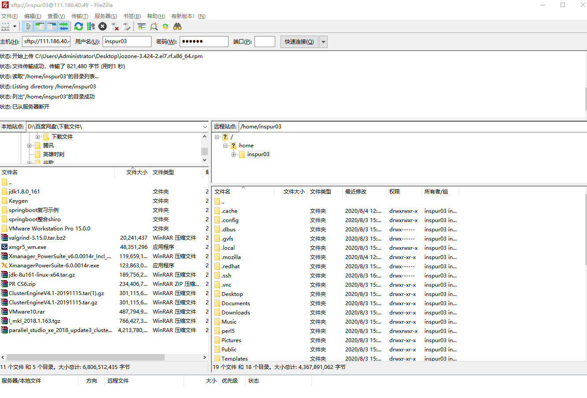

# Login
```danger
When you fail to log in, **DO NOT** try many times, your IP will be **banned** 😭
```
Use the domain name **gravity.sjtu.edu.cn** or IP address to log in.

```sh
ssh -i <your_ssh_key> <username>@gravity.sjtu.edu.cn
# for example 🌰
ssh -i /home/lalala/.ssh/id_rsa_For_Gravity lalala@gravity.sjtu.edu.cn
```

Also, you can set up your `~/.ssh/config`  to simplify your command 😎

- Edit your `~/.ssh/config` like this:
```
Host login01
    HostName <login01_IP_address>
    User lalala
    Port 22
    IdentityFile ~/.ssh/id_For_Gravity
Host login02
    HostName <login02_IP_address>
    User lalala
    Port 22
    IdentityFile ~/.ssh/id_rsa_For_Gravity
```
Here we go 🎉
```sh
ssh login01
ssh login02
```

The default log in node is **login02**.

File transfer can be done similarly with `scp` or `rsync`. Google it for detailed documentation.

## Linux/Mac/Windows

- On Linux/Mac, you can do this directly on the command line in a shell.
- On Windows, you may need to install a ssh client first. 
  - Windows 10 now comes with a default ssh client already installed. To use it, open windows `cmd` or powershell (type `cmd` or `powershell` in the windows search box next to the windows menu) and then you can use the ssh command. 
  - If you prefer a **GUI client**, there are many available such as the [bitwise ssh client](https://www.bitvise.com/ssh-client-download) or [putty](https://www.ssh.com/ssh/putty/download) or Xshell. We recommend  **[MobaXTerm](https://mobaxterm.mobatek.net/download.html)** (the best on I think😜)

## ssh-key based login

To login without using your password, first generate a key on your local computer:

- For Linux users:
  On your own computer, do
  
  ```
  ssh-keygen
  ```
  And then copy the public part of the key to the server with the following command:
  
  ```
  ssh-copy-id user@server
  ```
  
  (replace `user@server` with your username and our server address).   
  
  Once this is done you can login without inputting your password.
  
- For more information and for Windows users, please check here: 
  [https://upcloud.com/community/tutorials/use-ssh-keys-authentication/](https://upcloud.com/community/tutorials/use-ssh-keys-authentication/)


## 登陆集群

本文将向大家介绍如何通过 SSH 远程登录到 HPC 集群上。在阅读本文档之前，您需要具备 Linux/Unix、终端、MS-DOS、SSH 远程登录的相关知识，或者您可以阅读参考资料理解这些概念。

本文主要内容：

- 使用ssh登录集群的注意事项；
- 首次登录准备，如信息采集、客户端下载、ssh登录、ssh文件传输、无密码登录等；
- 故障排除和反馈。

按照文档的操作说明将有助于您完成工作，谢谢您的配合！

```note 
   * HPC账号仅限于同一课题组的成员使用，请勿将账号借给他人使用。
   * 请妥善保管好您的账号密码，不要告知他人。HPC管理员不会要求您提供密码。
   * 恶意的SSH客户端软件会窃取您的密码，请在官网下载正版授权SSH客户端软件。
   * 登录HPC集群后，请不要跳转到其他登录节点。任务完成后请关闭SSH会话。
   * 若无法登录，请检查输入密码或确认IP地址是否正确。您可以参考故障排除和反馈，将诊断信息发送给集群管理员[hpc](https://gravity-doc.github.io/index.html/#Contact)邮箱。
```

### 准备

通过 SSH 登录 HPC 集群，需要在客户端输入登录节点 IP 地址（或主机名），SSH 端口，SSH 用户名和密码。账号开通后您会收到以下内容的邮件：

```
ssh YOUR_USERNAME@gravity.sjtu.edu.cn or <login02_IP_address>
```

登录节点 IP 地址（或主机名）为 gravity.sjtu.edu.cn

SSH 端口为 22

### Windows用户登录集群

启动客户端 Xshell,填写登录节点地址：gravity.sjtu.edu.cn，端口号采用默认值22，然后点击连接，如下图所示：


在终端窗口中，输入您的SSH用户名和密码进行登录，如图2,图3所示：


其它常用windows下的ssh客户端：putty, bitvise ssh client

### Linux/Unix/Mac 用户

Linux / Unix / Mac 用户可以使用终端中的命令行工具登录。下列语句指出了该节点的IP地址、用户名和SSH端口。

```bash
$ ssh YOUR_USERNAME@TARGET_IP
```

## File transfer to/from server

 ### Windows 用户使用ssh传输文件

安装 Filezilla 软件后，可以双击打开该软件，按照下图进行设置，完成后单击快速链接或者回车可以登录ftp 站点。
输入数据集群IP 用户名 密码和端口号，如下图所示：



### Linux/Unix/Mac用户使用ssh传输文件

Linux/Unix/Mac 用户可以使用命令行工具在集群和您自己的计算机之间传输数据。下列语句会将文件夹data/上传到主文件夹的tmp/。

```bash
$ scp -r data/ YOUR_USERNAME@TARGET_IP:tmp/
```

下列语句会将主文件夹的data.out下载到本地当前工作目录中。

```bash
$ scp YOUR_USERNAME@TARGET_IP:data.out ./
```


