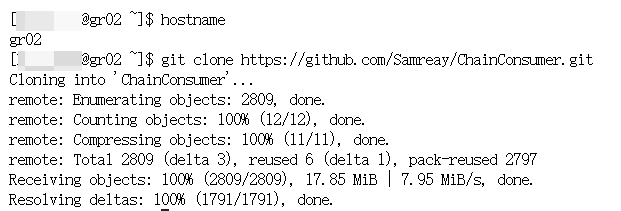

# Surf the Internet🏄‍

```tip
- On [**Gravity Web**](https://jupyter.gravity.sjtu.edu.cn/), you can access the Internet🏄‍ when using **Jupyter/VScode** on **login/computing nodes**   
- We will speed up🚀 your **git** connection automatically
```

## 1. Spawn a server
open [our website](https://jupyter.gravity.sjtu.edu.cn/) → click *Jupyter* button → *log in* → *start my server*


select a job queue → input resource setting → Start


## 2. Enjoy
You can use `git/wget/curl etc.` to access the Internet.

For example🌰:



# Speedup Git⚡

```tip
When using **terminal**, you can use `pgit` to speed up🚀 your `git` connection
```

## 1. Why
When we use `git clone`, `git pull` or whatever related to git, somehow, there is a wired phenomenon: The speed of connection is **too slow**, or we **cannot even access** [Github](https://github.com)

Therefore, we provide `pgit` (*proxy git*) to solve this problem🥳   

## 2. Usage
### pgit

```tip
On **login01/login02**, `pgit` **==** `git`😎    
P.S. `pgit` means **proxy git**
```

**Common usage:**

| **Git**                  | ⚡                     |
| -------------------- | --------------------- |
| `git pull`           | `pgit pull`           |
| `git push`           | `pgit push`           |
| `git clone <url>`    | `pgit clone <url>`    |
| `git fetch <remote>` | `pgit fetch <remote>` |
| `git remote -v`      | `pgit remote -v`      |
| `git xxxxxxxx`       | `pgit xxxxxxxx`       |

**For example**🌰
let us use `pgit` to clone this repo `https://github.com/Samreay/ChainConsumer.git` 👇

```bash
╭─lalala ~ 
╰─$ pgit clone https://github.com/Samreay/ChainConsumer.git
################## Here we go! ༼ つ ◕_◕ ༽つ ####################
Cloning into 'ChainConsumer'...
remote: Enumerating objects: 2797, done.
remote: Total 2797 (delta 0), reused 0 (delta 0), pack-reused 2797
Receiving objects: 100% (2797/2797), 17.84 MiB | 3.04 MiB/s, done.
Resolving deltas: 100% (1788/1788), done.
```

### http_proxy
If you prefer to set environment variables, you can use `http_proxy` and `https_proxy` to speed up🚀 your **Github** connection.

```bash
# set http proxy
export http_proxy=http://login02:6666
export https_proxy=http://login02:6666

# git setting
git config --global http.proxy $http_proxy
git config --global https.proxy $http_proxy
git config --global core.sshCommand 'ssh -o "ProxyCommand=ncat -v --proxy-type socks5 --proxy login02:6666 %h %p"'
```

Let us **check** our connection

```bash
# check curl
curl -v github.com

# check clone repo
git clone https://github.com/Samreay/ChainConsumer.git
```

If you want to **cancel** the proxy, you can use `unset` command

```bash
unset {http,https}_proxy
git config --global --unset http.proxy https.proxy
git config --global --unset https.proxy
git config --global --unset core.sshCommand
```

```warning
**Attention!** There is **NO warranty**! But we will try our best to maintain this service😊
```
