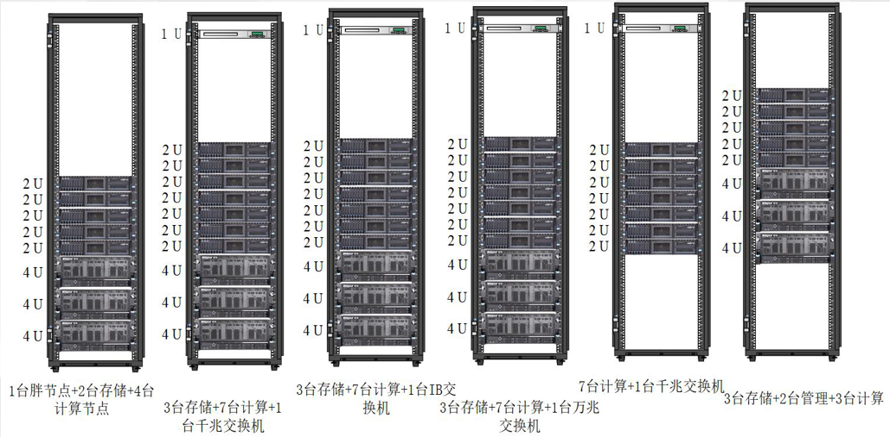

# Introduction

## Login nodes
- 2 login nodes
   - 1个登录节点是login01、1个登录节点是login02，Intel Gold 6240 CPU（2.6GHz,18C）。

## Computing nodes
- 36 compute nodes
    - 72 cores, 384G memo，Intel Gold 6240 CPU（2.6GHz,18C）
    
- 1 fat node
    - 192 cores, 6T memo，Intel Platinum 8268 CPU（2.9GHz，24C）。

## Storage
Parallel storage
Total amount:4.2p

## Network
- ipmi：硬件管理网络-千兆  ip网段（192.168.11.1）
- 系统网络：计算节点采用千兆网络，存储节点采用万兆网络ip网段（192.168.10.1）
- 计算网络：IB网网段（10.0.0.1）

