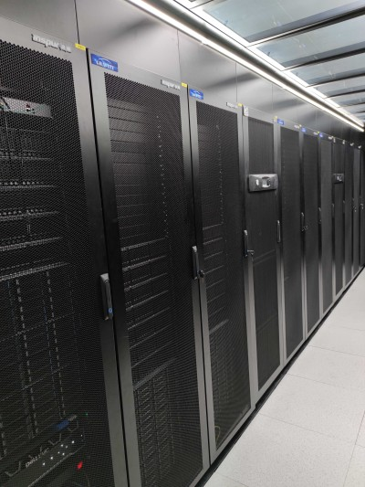

# Hardware specification
 [download high-resolution version](https://github.com/gravity-doc/gravity-doc.github.io/blob/master/imgs/gravity.jpg)

## Login nodes
- 2 login nodes **login02** (primary) and **login01** (backup)
   - 2x Intel Gold 6240 CPU（2.6GHz, 18C)
   - 192G memo.

## Computing nodes
- 36 compute nodes **gr01** - **gr36**
    - each node has 4x Intel Gold 6240 CPU (2.6GHz, 18C), 72 cores in total.
    - each node has 384G mem (>5G per core).
    
- 1 fat node **fat01**
    - 8x Intel Platinum 8268 CPU（2.9GHz，24C), 192 cores total.
    - 6TB mem
- 1 GPU node **gr36**
    - This node has 1X NVIDIA Tesla V100s PCIe 32 GB card, together with 4X Intel Gold 6240 CPU (2.6GHz,18C). 
    

## Storage
- Inspur AS13000 parallel storage, with 17 nodes, inter-connected with a dual-10Gbps network. 
- Usable capacity 4.2PB (raw 5.3PB, configured with 8:2 eraser code for redundacy)
- IO speed ~20GB/s.

## Network
- computation network: Mellanox infiniband HDR configured at 100Gb/s.
- internet: 10Gb/s connetion to the internet through campus network.

